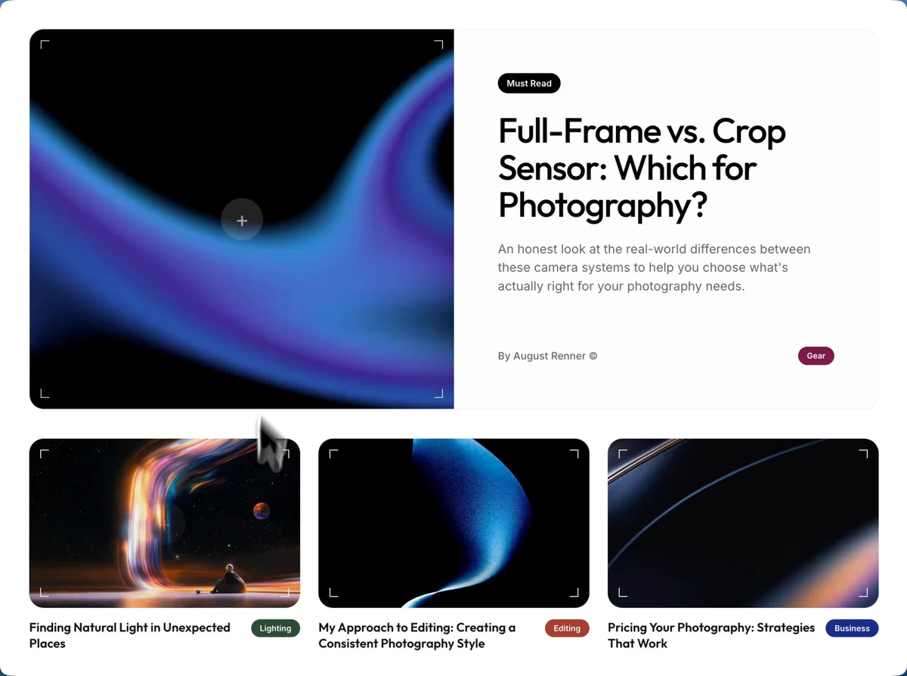

<div align="center">

<br />

# Behind the Lens

**A modern photography blog platform for creators and visual storytellers.**

[](https://reactjs.org/)
[](https://vitejs.dev/)
[](https://tailwindcss.com/)
[](https://www.typescriptlang.org/)
[](./LICENSE)

<br />



</div>

---

## Overview

Behind the Lens is a photography blog platform built for photographers and visual creators who want a clean, fast, and beautiful space to share their work. It combines the performance of Vite, the flexibility of React, and the precision of TypeScript to deliver a polished publishing experience.

---

## Features

- Responsive, modern UI designed for photography-first content
- Smooth animations and fluid layout transitions
- Fast page loads with Vite's optimized build pipeline
- Type-safe codebase with TypeScript throughout
- Clean, utility-first styling with Tailwind CSS v4

---

## Tech Stack

| Technology      | Role               |
| --------------- | ------------------ |
| React 19        | UI Framework       |
| Vite            | Build Tool         |
| Tailwind CSS v4 | Styling            |
| TypeScript      | Type Safety        |

---

## Getting Started

### Prerequisites

- Node.js 18 or higher
- npm or yarn

### Installation

```bash
# Clone the repository
git clone https://github.com/cmokehleza/Behind-the-lens.git

# Navigate into the project
cd Behind-the-lens

# Install dependencies
npm install

# Start the development server
npm run dev
```

The app will be available at `http://localhost:5173` by default.

---

## Scripts

| Command           | Description                     |
| ----------------- | ------------------------------- |
| `npm run dev`     | Start local development server  |
| `npm run build`   | Build for production            |
| `npm run preview` | Preview the production build    |

---

## Project Structure

```
Behind-the-lens/
├── public/
│   └── images/
│       └── thumbnail.webp    # Preview image
├── src/
│   ├── lib/                  # Utilities & helpers
│   ├── utils/                # Helper functions
│   ├── App.tsx               # Root component
│   ├── blog.css              # Blog-specific styles
│   ├── index.css             # Global styles
│   ├── main.tsx              # App entry point
│   └── vite-env.d.ts         # Vite type declarations
├── .gitignore
├── demo.png
├── index.html
├── package.json
├── package-lock.json
├── tsconfig.json
├── vite.config.ts
└── README.md
```

---

## Live Demo

[https://your-website-link.com](https://your-website-link.com)

---

## License

This project is licensed under the [MIT License](./LICENSE).

---

## Author

Developed by **cmoke**